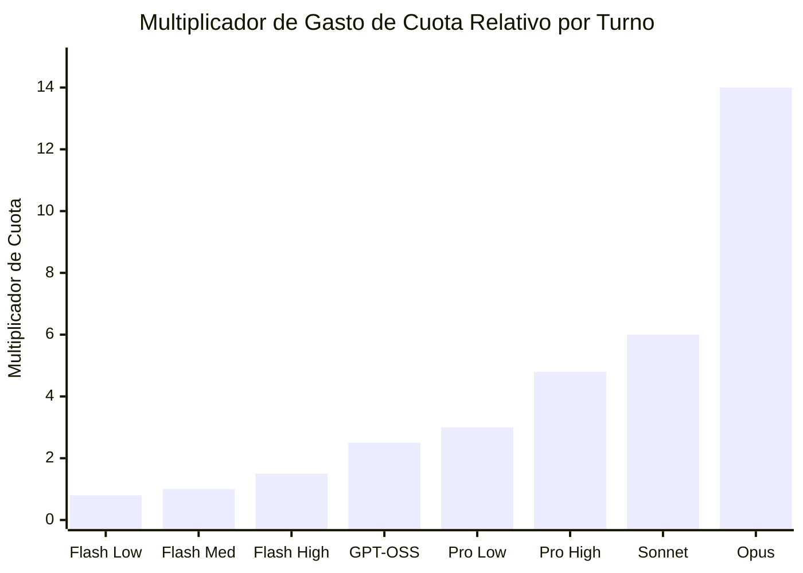
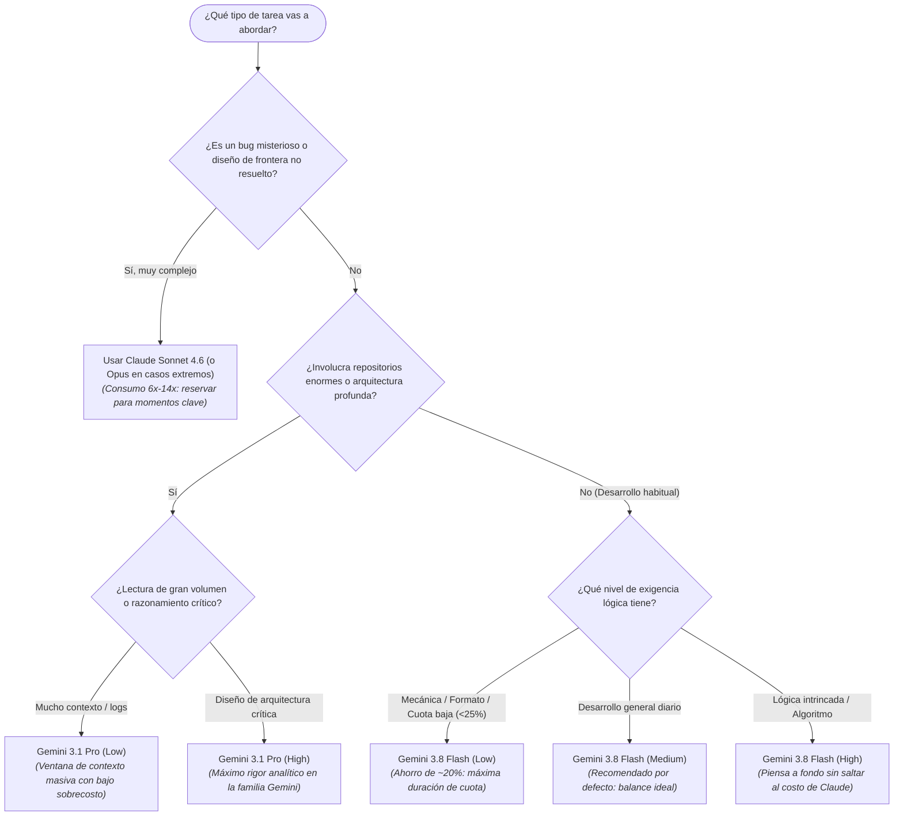

# Guía de Consumo de Tokens y Duración de Cuota por Modelo

Esta guía detalla el consumo relativo de tokens, cuota y niveles de razonamiento interno de los modelos disponibles en tu menú de Antigravity, explicando por qué algunos agotan tu límite rápidamente, qué implica cada nivel (**Low**, **Medium**, **High**) y cuánto tiempo de trabajo rinde cada combinación.

| Menú de Selección | Modelos Detectados |
| :---: | :--- |
|  | Selector activo de Antigravity con los niveles de pensamiento (**Low**, **Medium**, **High**) en la familia Flash y Pro, junto a los modelos de razonamiento profundo (**Thinking**). |

---

## 1. El Factor Oculto: Tokens de Salida, "Thinking" y sus Niveles

En los modelos de lenguaje y agentes de programación:
- **Tokens de Entrada (Prompt + Contexto)**: El código y los archivos que el agente lee de tu proyecto. Tienen un costo de cómputo bajo.
- **Tokens de Salida (Código y Respuestas)**: El texto y código generado visiblemente. Tienen un costo considerablemente mayor en la cuota.
- **Tokens de Razonamiento ("Thinking" / Thought Tokens)**: Antes de escribir una sola línea de código o respuesta visible, los modelos con razonamiento generan un bloque interno de pensamiento para planificar, auditar dependencias y anticipar fallos. **Estos tokens computan como tokens de salida en la cuota**, por lo que un modelo con pensamiento profundo consume cuota mucho más rápido.

### ¿Qué implican los niveles Low, Medium y High? (Arquitectura `thinking_level`)

En la arquitectura moderna de Gemini en Antigravity, el parámetro de control de pensamiento (`thinking_level`) modula la profundidad de este proceso reflexivo interno:

| Nivel de Pensamiento | Tokens de Thinking Estimados | Impacto en Cuota vs Medium | Latencia / Tiempo de Respuesta | ¿Qué hace internamente? |
| :---: | :---: | :---: | :---: | :--- |
| **Low** | ~0 – 1.000 tokens | **-20% a -25%**<br>*(~0.8x del base)* | **Inmediata**<br>(< 1 seg) | Razonamiento directo y mínimo. No genera ramificaciones deductivas extensas. Resuelve el prompt en línea recta con mínima latencia y máximo ahorro de cuota. |
| **Medium** *(Default)* | ~1.000 – 4.000 tokens | **1.0x**<br>*(Línea Base de Referencia)* | **Rápida**<br>(1 a 3 seg) | Nivel equilibrado oficial. El modelo analiza el contexto, valida dependencias básicas y prevé efectos colaterales antes de codificar, manteniendo un consumo moderado. |
| **High** | ~6.000 – 16.000+ tokens | **+40% a +60%**<br>*(~1.5x del base)* | **Deliberada**<br>(4 a 10 seg) | Razonamiento exhaustivo. El modelo formula hipótesis, simula casos de borde, hace backtracking y autocrítica antes de emitir la primera línea. Ideal para lógica compleja sin pagar el coste extremo de Claude. |

### ¿Por qué Claude y GPT-OSS no tienen los 3 niveles en el selector?
- **Claude Sonnet 4.6 y Claude Opus 4.6 (Thinking)**: Anthropic utiliza un sistema de *Extended Thinking* con presupuestos dinámicos profundos (no expone tiers manuales Low/Medium/High en este menú). Cuando se seleccionan, el pensamiento profundo siempre está activo, con un consumo intensivo (**6.0x** y **12.0x–15.0x** respectivamente).
- **GPT-OSS 120B (Medium)**: Es un modelo de código abierto servido en Antigravity con un preset fijo y calibrado a nivel `Medium`. No cuenta con variantes Low o High en la plataforma.
- **Gemini 3.1 Pro (Low y High)**: No ofrece `Medium` porque su arquitectura está optimizada para dos extremos claros: **Low** (aprovechar su gigantesca ventana de contexto para leer proyectos enteros gastando pocos tokens en deducción) o **High** (arquitectura de software crítica y auditoría profunda de alto calibre).

---

## 2. Tabla Comparativa de Modelos y Duración Estimada

Tomando como base una ventana típica de cuota de sesión en Antigravity (ej. sesión intensiva de pair programming con lectura de archivos y ejecución de herramientas):

| Modelo y Variante | Nivel / Preset | Multiplicador de Consumo | Prompts Típicos por Ventana | Duración Estimada de Sesión | Mejor Caso de Uso |
| :--- | :---: | :---: | :---: | :---: | :--- |
| **Gemini 3.8 Flash (Low)** | `Low` | **0.8x** | ~280 – 420 prompts | **Día completo extendido**<br>(12–16h de trabajo) | Tareas repetitivas, formateo, refactors sintácticos, comandos y scripts simples. |
| **Gemini 3.8 Flash (Medium)** *(Default)* | `Medium` | **1.0x** *(Base)* | ~200 – 350 prompts | **Día completo**<br>(8–12h continuas) | Desarrollo cotidiano, nuevos componentes, lógica estándar y tests. |
| **Gemini 3.8 Flash (High)** | `High` | **1.5x** | ~140 – 220 prompts | **Jornada sólida**<br>(6–8 horas) | Lógica algorítmica compleja, debugging de estado o APIs donde Flash debe pensar a fondo. |
| **Gemini 3.7 Flash (Low)** | `Low` | **0.8x** | ~280 – 420 prompts | **Día completo extendido**<br>(12–16h) | Consultas directas, documentación y modificaciones puntuales. |
| **Gemini 3.7 Flash (Medium)** | `Medium` | **1.0x** | ~200 – 350 prompts | **Día completo**<br>(8–12 horas) | Pair programming estándar y soporte continuo en tareas web/backend. |
| **Gemini 3.7 Flash (High)** | `High` | **1.5x** | ~140 – 220 prompts | **Jornada sólida**<br>(6–8 horas) | Diagnóstico intermedio de dependencias y refactors medianos. |
| **Gemini 3.6 Flash (Low)** | `Low` | **0.75x** | ~300 – 450 prompts | **Día completo + extra**<br>(14+ horas) | Modo ahorro extremo: redacción de textos, markdown, git status, tareas mecánicas. |
| **Gemini 3.6 Flash (Medium)** | `Medium` | **0.9x** | ~220 – 380 prompts | **Día completo**<br>(10+ horas) | Tareas ágiles con consumo muy reducido. |
| **Gemini 3.6 Flash (High)** | `High` | **1.35x** | ~160 – 250 prompts | **Jornada estándar**<br>(7–9 horas) | Razonamiento ligero sobre versión anterior del motor Flash. |
| **GPT-OSS 120B (Medium)** | *Preset Fijo* | **2.5x** | ~80 – 120 prompts | **Media jornada**<br>(4–6 horas) | Revisiones de código con enfoque open-weights y tareas intermedias. |
| **Gemini 3.1 Pro (Low)** | `Low` | **3.0x** | ~65 – 100 prompts | **4 a 5 horas**<br>(sesión de arquitectura) | Ingesta masiva de contexto: leer repositorios grandes, múltiples PDFs o logs extensos sin inflar cuota. |
| **Gemini 3.1 Pro (High)** | `High` | **4.8x** | ~40 – 65 prompts | **2.5 a 3.5 horas**<br>(trabajo exhaustivo) | Auditoría de arquitectura crítica, seguridad, refactor integral multimodular. |
| **Claude Sonnet 4.6 (Thinking)** | *Extended Thinking* | **6.0x** | ~30 – 45 prompts | **1.5 a 2.5 horas**<br>continuas | Bugs esquivos muy difíciles, frontend de alta fidelidad, lógica matemática/asíncrona estricta. |
| **Claude Opus 4.6 (Thinking)** | *Deep Thinking* | **12.0x – 15.0x** | ~12 – 20 prompts | **45 min a 1.5 horas**<br>(agotamiento rápido) | Máxima capacidad de diseño conceptual e investigación algorítmica de frontera. |

> [!NOTE]
> Las duraciones y número de prompts son estimaciones basadas en interacciones típicas con el agente. El consumo real varía con el tamaño de los archivos leídos y la cantidad de herramientas (MCP, búsqueda, terminal) ejecutadas en cada turno.

---

## 3. Gráficos Comparativos

### Impacto en la Cuota por Turno (Base Gemini 3.8 Flash Medium = 1.0x)



### Clasificación de Modelos por Durabilidad de Cuota

```mermaid
flowchart LR
    subgraph Durabilidad_Maxima["🟢 Durabilidad Máxima (8–16 hrs)"]
        FL["Gemini Flash (Low) - 0.8x"]
        FM["Gemini Flash (Medium) - 1.0x"]
        FH["Gemini Flash (High) - 1.5x"]
    end

    subgraph Durabilidad_Media["🟡 Durabilidad Media (3–6 hrs)"]
        GP["GPT-OSS 120B (Med) - 2.5x"]
        PL["Gemini 3.1 Pro (Low) - 3.0x"]
        PH["Gemini 3.1 Pro (High) - 4.8x"]
    end

    subgraph Consumo_Critico["🔴 Consumo Crítico (45 min – 2.5 hrs)"]
        SN["Claude Sonnet 4.6 Thinking - 6.0x"]
        OP["Claude Opus 4.6 Thinking - 14.0x"]
    end

    Durabilidad_Maxima -->|Transición x2.5 a x3| Durabilidad_Media
    Durabilidad_Media -->|Transición x2 a x3| Consumo_Critico
```



---

## 4. Árbol de Decisión: ¿Qué modelo y nivel elegir?



---

## 5. Estrategia Práctica para Maximizar tu Cuota

> [!TIP]
> **Plan de Juego Diario para Desarrolladores**:
> 1. **Tu configuración por defecto: `Gemini 3.8 Flash (Medium)`**:
>    Ofrece la mejor relación calidad/velocidad/consumo. Cubre el 80% del trabajo diario (escribir código, componentes, endpoints, pruebas y ejecución de comandos) rindiendo una jornada completa.
> 2. **Baja a `Gemini 3.8 Flash (Low)` cuando**:
>    - Tu cuota esté por debajo del 25% y necesites exprimir cada token hasta el reinicio.
>    - Realices tareas mecánicas: corregir estilos CSS, formatear JSON, crear archivos markdown, ejecutar comandos de terminal o resolver lints sencillos. Ahorras un ~20% respecto a Medium.
> 3. **Sube a `Gemini 3.8 Flash (High)` antes de cambiar de modelo**:
>    Si Flash Medium no resuelve un problema de lógica al primer intento, antes de saltar a Claude (que consume 6x), activa `Gemini 3.8 Flash (High)`. El modelo profundizará en sus deducciones internas y muy a menudo resolverá el bug con solo 1.5x de consumo.
> 4. **Usa `Gemini 3.1 Pro (Low)` para 'Context Hounds'**:
>    Cuando necesites que el agente indexe y comprenda un proyecto completo con decenas de miles de líneas o lea múltiples documentos simultáneamente.
> 5. **Reserva `Claude Sonnet 4.6` como 'Francotirador'**:
>    Cámbialo únicamente cuando Flash High no logre desatascar un bug sutil de renderizado, concurrencia o lógica abstracta. Una vez resuelto el problema, vuelve de inmediato a Gemini Flash.
> 6. **Monitorea tu cuota en tiempo real**:
>    Haz clic en **View Usage** en la parte inferior del menú de modelos para revisar tu porcentaje restante antes de lanzar tareas complejas.

---

## 6. Software Recomendado para Visualizar Markdown (.md) como en GitHub

Para abrir este archivo `.md` (y cualquier documentación técnica) en tu computadora y que se renderice **tan visual, limpio y profesional como en GitHub** —con soporte total para diagramas **Mermaid**, tablas estilizadas, alertas (`[!NOTE]`, `[!TIP]`, `[!WARNING]`) y resaltado de sintaxis en bloques de código—, te recomendamos las siguientes aplicaciones:

### 1. 🥇 Obsidian (La mejor experiencia visual y gratuita)
* **Plataformas**: macOS, Windows, Linux, iOS, Android.
* **¿Por qué es la opción n.º 1?**:
  - **Live Preview en tiempo real**: Formatea el texto inmediatamente mientras escribes sin necesidad de paneles divididos.
  - **Soporte nativo de Mermaid**: Renderiza diagramas de flujo y gráficos automáticamente sin requerir configuración adicional.
  - **Callouts / Alerts estilo GitHub**: Interpreta de forma nativa bloques `> [!NOTE]`, `> [!TIP]`, `> [!WARNING]`, etc., con colores e iconos idénticos a GitHub.
  - **Temas**: Cuenta con cientos de temas (ej. *Minimal*, *Things* o *GitHub Theme*) que le dan un acabado visual de primer nivel.
* **Descarga**: [obsidian.md](https://obsidian.md) (100% gratuito para uso personal).

---

### 2. 🥈 VS Code / Cursor / Antigravity (Tu editor habitual con extensiones)
Si prefieres no salir de tu entorno de desarrollo:
* **Vista previa**: Presiona `Ctrl + Shift + V` (o `Cmd + Shift + V` en macOS) para abrir el visor Markdown integrado.
* **Extensiones recomendadas para máxima fidelidad**:
  - **Markdown Preview Mermaid Support** (por Matt Bierner): Habilita el renderizado de gráficos y diagramas Mermaid en la vista previa nativa.
  - **GitHub Markdown Preview**: Aplica la tipografía y hoja de estilo CSS oficial de GitHub.
  - **Markdown Preview Enhanced**: Suite avanzada con soporte de diagramas, LaTeX y exportación directa a PDF/HTML.

---

### 3. 🥉 Typora (Elegancia minimalista WYSIWYG)
* **Plataformas**: macOS, Windows, Linux.
* **¿Por qué destaca?**: Oculta la sintaxis Markdown en cuanto terminas cada línea, logrando una interfaz limpia como la de un artículo publicado.
* **Tema GitHub**: Incorpora el tema oficial de GitHub para previsualizar tablas, tipografías y bordes idénticos a los de un repositorio.
* **Descarga**: [typora.io](https://typora.io) (Prueba gratuita y licencia de pago único).

---

### 4. 🚀 MarkText (Alternativa Open Source y gratuita a Typora)
* **Plataformas**: macOS, Windows, Linux.
* **¿Por qué destaca?**: Totalmente libre, gratuito y enfocado en velocidad. Compatible con GitHub Flavored Markdown (GFM), diagramas Mermaid y expresiones matemáticas en KaTeX.
* **Descarga**: [marktext.app](https://marktext.app) / [GitHub](https://github.com/marktext/marktext).

---

### 5. ⚡ Grip (Visualizador instantáneo por Terminal)
* Si trabajas en terminal y quieres previsualizar tu archivo servido localmente usando el motor exacto de la API de GitHub:
  ```bash
  pip install grip
  grip model_consumption_guide.md
  ```
* Abre automáticamente un servidor local en `http://localhost:6419` con renderizado 1:1 idéntico a GitHub.
